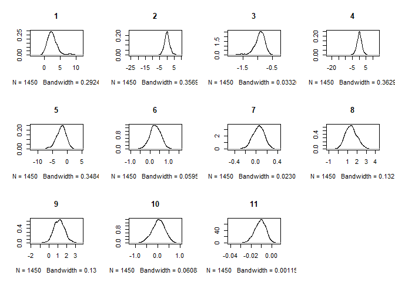
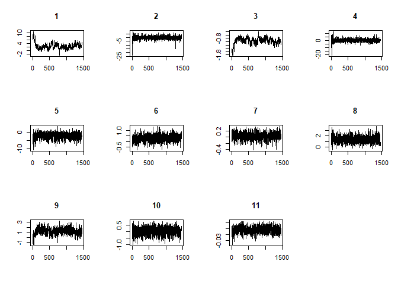

<!-- README.md is generated from README.Rmd. Please edit that file -->

## The `BayesMFSurv` package

*Minnie M. Joo, Nicolas Schmidt, Sergio Bejar, Bumba Mukherjee, Vineeta Yadav*

<!-- badges: start -->

[](https://cran.r-project.org/package=BayesMFSurv)
[](https://www.r-pkg.org/pkg/BayesMFSurv)
<!-- badges: end -->

### Description

Contains a split population survival estimator that models the
misclassification probability of failure versus right-censored events.
The split population survival estimator is described in Bagozzi et
al. (2019) <doi:10.1017/pan.2019.6>.

### Installation

You can install the released version (`0.1.0`) of `BayesMFSurv` from
[CRAN](https://cran.r-project.org/) with:

``` r
install.packages("BayesMFSurv")
```

And the development version (`0.2.0`) from GitHub with:

``` r
if (!require("remotes")) install.packages("remotes")
remotes::install_github("Nicolas-Schmidt/BayesMFSurv")
```

## Functions

| Function   | Description                                                                                                                                                                     |
| ---------- | ------------------------------------------------------------------------------------------------------------------------------------------------------------------------------- |
| `mfsurv`   | fits a parametric Bayesian MF model via Markov Chain Monte Carlo (MCMC) to estimate the probability of misclassification in the first stage and the hazard in the second stage. Slice sampling is employed to draw the posterior sample of the model's split and survival stage parameters.
| `mcmcsurv` | estimates a Bayesian Exponential or Weibull survival model via Markov Chain Monte Carlo (MCMC). Slice sampling is employed to draw the posterior sample of the model's survival stage parameters.                                                                                                               |
| `stats`    | a function to calculate the deviance information criterion (DIC) and the log-likelihood for fitted model objects of class mfsurv or mcmcsurv.                                    |
| `summary`  | returns a summary of a mfsurv or mcmcsurv object via `coda::summary.mcmc`.                                                                                                       |

### Example

The data used to estimate the following examples come from Reenock,
Bernhard and Sobek (2007) -DOI: 10.111/j.1468-2478.2007.00469.x-. The
RBS (2007) dataset uses continuous-time event history techniques to code
episodes of democratic breakdown in all democracies from 1961 to 1995.
In addition, it provides data on a number of economic and political
variables.

| Variable     | Description                                         |
| ------------ | --------------------------------------------------- |
| **calinv**   | inverse of per capita daily caloric supply          |
| **lnlevel**  | natural log of economic development                 |
| **calileve** | inverse of per capita daily caloric supply\*lnlevel |
| **necon**    | economic performance                                |
| **presi**    | presidential regime                                 |
| **tag**      | effective number of parties                         |
| **rel**      | religious fractionalization                         |
| **ethn**     | ethnic fractionalization                            |
| **prevdem**  | numbers of previous democratic episodes             |
| **openc**    | trade openness                                      |
| **Y**        | years in current democratic episode                 |
| **Y0**       | years in current democratic episode (lagged)        |
| **C**        | breakdown of democratic episode                     |

#### Misclassified-Failure

``` r

# Baseline Bayesian misclassified failure (MF) model. 
# Misclassification stage only includes the intercept while the survival stage 
# includes all covariates described above.  

library(BayesMFSurv)

set.seed(95)
RBS <- na.omit(RBS)
Y   <- RBS$Y
X   <- as.matrix(cbind(1, RBS[,1:10]))
C   <- RBS$C
Z1  <- cbind(rep(1,nrow(RBS)))
Y0  <- RBS$Y0
model1 <- mfsurv(Y ~ X | C ~ Z1, Y0 = Y0,
                 N = 15000,
                 burn = 500,
                 thin = 10,
                 w = c(0.5, .5, .5),
                 m = 20,
                 form = "Weibull",
                 na.action = 'na.omit')
```

``` r
stats(model1)
#> $DIC
#> [1] -1143.507
#> 
#> $Loglik
#> [1] 313.3516

summary(model1, parameter = c("betas"))
#> 
#> Iterations = 1:1450
#> Thinning interval = 1 
#> Number of chains = 1 
#> Sample size per chain = 1450 
#> 
#> 1. Empirical mean and standard deviation for each variable,
#>    plus standard error of the mean:
#> 
#>                Mean    SD Naive SE Time-series SE
#> X.intercept  1.9355 4.321  0.11348        0.79595
#> X1           2.1649 3.665  0.09626        0.20639
#> Xcalinv     -2.1401 8.554  0.22464        2.56889
#> Xlnlevel    -0.7722 2.576  0.06765        0.22042
#> Xcalileve    1.0363 5.017  0.13176        1.14224
#> Xnecon      -2.5677 4.150  0.10898        0.61198
#> Xpresi      -1.5871 7.896  0.20737        1.29690
#> Xtag         0.6978 4.137  0.10865        1.08049
#> Xrel         1.3999 2.025  0.05319        0.08881
#> Xethn       -0.3696 5.114  0.13430        1.58109
#> Xprevdem     0.1300 4.684  0.12301        0.44054
#> Xopenc      -1.8214 6.473  0.17000        1.36454
#> 
#> 2. Quantiles for each variable:
#> 
#>                2.5%      25%     50%       75%      97.5%
#> X.intercept  -2.110  0.24896  1.2424  2.206557 17.3847448
#> X1           -4.463  0.89075  2.0461  3.377760 10.3437864
#> Xcalinv     -33.180 -1.65935 -0.2228  1.095802  3.7744287
#> Xlnlevel     -3.654 -1.18702 -1.0269 -0.898165  5.6936900
#> Xcalileve    -4.036 -1.04590  0.1827  1.644694 19.5263103
#> Xnecon      -15.987 -3.35028 -1.9316 -0.677644  2.7107234
#> Xpresi      -36.181 -0.01210  0.2356  0.469842  2.3082876
#> Xtag         -3.264 -0.04375  0.0549  0.143694 15.2352439
#> Xrel         -3.156  0.89412  1.4285  1.942361  6.1048869
#> Xethn       -19.721  0.31508  0.8605  1.389842  2.4493112
#> Xprevdem     -9.541 -0.18781  0.0551  0.277014 15.0597364
#> Xopenc      -27.635 -0.01933 -0.0132 -0.008626 -0.0009126
```

#### Non Misclassified-Failure

``` r
set.seed(95)
model2 <- mcmcsurv(Y = Y, Y0 = Y0, C =  C,  X = X, 
                   N = 15000, 
                   burn = 500, 
                   thin = 10, 
                   w = c(0.5, 0.5, 0.5),
                   m = 20, 
                   form = "Weibull")
```

``` r
stats(model2)
#> $DIC
#> [1] -937.9898
#> 
#> $Loglik
#> [1] 406.0937

summary(model2, parameter = c("betas"))
#> 
#> Iterations = 1:1450
#> Thinning interval = 1 
#> Number of chains = 1 
#> Sample size per chain = 1450 
#> 
#> 1. Empirical mean and standard deviation for each variable,
#>    plus standard error of the mean:
#> 
#>               Mean       SD  Naive SE Time-series SE
#> X1         2.51481 1.709420 0.0448916      0.3005889
#> Xcalinv   -0.06664 2.225281 0.0584387      0.0862545
#> Xlnlevel  -0.94028 0.199542 0.0052402      0.0335193
#> Xcalileve  0.02971 2.162636 0.0567936      0.0809021
#> Xnecon    -2.13686 1.751111 0.0459864      0.0696546
#> Xpresi     0.28542 0.291404 0.0076527      0.0102171
#> Xtag       0.04106 0.109635 0.0028791      0.0037634
#> Xrel       1.40353 0.628743 0.0165116      0.0210372
#> Xethn      1.14562 0.640030 0.0168080      0.0591352
#> Xprevdem   0.02349 0.293343 0.0077036      0.0089523
#> Xopenc    -0.01113 0.005499 0.0001444      0.0002753
#> 
#> 2. Quantiles for each variable:
#> 
#>               2.5%      25%      50%       75%     97.5%
#> X1        -0.07736  1.41928  2.30796  3.285902  7.801641
#> Xcalinv   -4.06635 -1.16363 -0.02407  1.114916  4.158685
#> Xlnlevel  -1.52077 -1.02394 -0.90893 -0.811584 -0.637564
#> Xcalileve -3.99743 -1.13507  0.08103  1.181787  4.188306
#> Xnecon    -6.13402 -3.18673 -1.97276 -0.962183  0.904850
#> Xpresi    -0.28510  0.10039  0.27996  0.480292  0.831018
#> Xtag      -0.18224 -0.03058  0.04745  0.118333  0.245317
#> Xrel       0.24135  0.96086  1.37781  1.808208  2.753970
#> Xethn     -0.12731  0.72600  1.15664  1.555914  2.436604
#> Xprevdem  -0.57760 -0.16734  0.03143  0.221004  0.572993
#> Xopenc    -0.02229 -0.01464 -0.01062 -0.007251 -0.001303
```



#### Citation

To cite package`BayesMFSurv` in publications, please use:

``` r
citation(package = 'BayesMFSurv')
```
