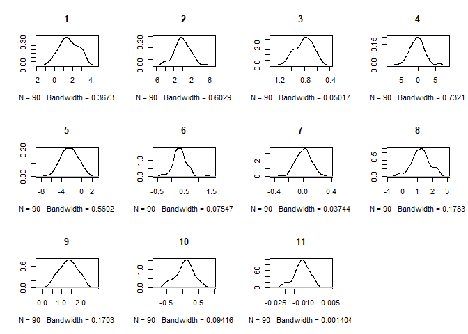
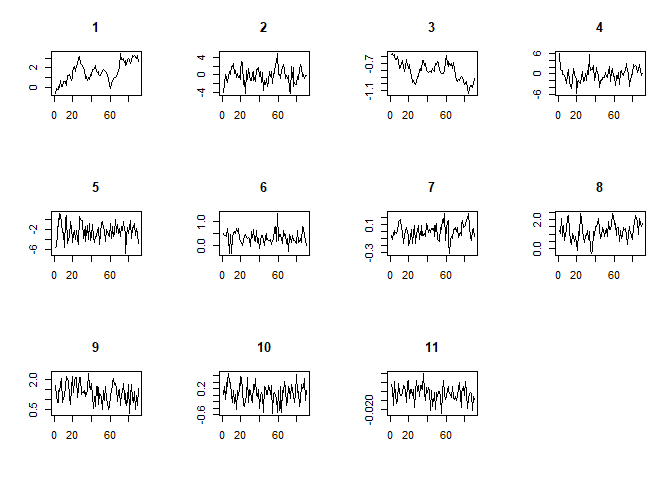

<!-- README.md is generated from README.Rmd. Please edit that file -->

## The `BayesMFSurv` package

*Minnie M. Joo, Sergio Bejar, Nicolas Schmidt, Bumba
Mukherjee*

<!-- badges: start -->

[](https://cran.r-project.org/package=BayesMFSurv)
[](https://www.r-pkg.org/pkg/BayesMFSurv)
<!-- badges: end -->

### Description

Contains a split population survival estimator that models the
misclassification probability of failure versus right-censored events.
The split population survival estimator is described in Bagozzi et
al. (2019) <doi:10.1017/pan.2019.6>.

### Installation

You can install the released version (`0.1.0`) of `BayesMFSurv` from
[CRAN](https://cran.r-project.org/) with:

``` r
install.packages("BayesMFSurv")
```

And the development version (`0.2.0`) from GitHub with:

``` r
if (!require("remotes")) install.packages("remotes")
remotes::install_github("Nicolas-Schmidt/BayesMFSurv")
```

## Functions

| Function                      | Description                                                                                                                                                                     |
| ----------------------------- | ------------------------------------------------------------------------------------------------------------------------------------------------------------------------------- |
| `mfsurv`                      | fits a parametric Bayesian MF model via Markov Chain Monte Carlo (MCMC) to estimate the probability of misclassification in the first stage and the hazard in the second stage. |
| `mfsurv.stats`                | a function to calculate the deviance information criterion (DIC) and the log-likelihood for fitted model objects of class mfsurv                                                |
| `mfsurv.summary`              | returns a summary of a mfsurv object via `coda::summary.mcmc`                                                                                                                   |
| `betas.post2`                 | log-posterior distribution of betas with pth element fixed as betas.p                                                                                                           |
| `betas.slice.sampling2`       | slice sampling for betas                                                                                                                                                        |
| `univ.betas.slice.sampling2`  | univariate slice sampling for betas.p                                                                                                                                           |
| `gammas.post2`                | log-posterior distribution of gammas with pth element fixed as gammas.p                                                                                                         |
| `gammas.slice.sampling2`      | slice sampling for gammas                                                                                                                                                       |
| `univ.gammas.slice.sampling2` | univariate slice sampling for gammas.p                                                                                                                                          |
| `lambda.post2`                | log-posterior distribution of lambda                                                                                                                                            |
| `lambda.slice.sampling2`      | univariate slice sampling for lambda                                                                                                                                            |
| `mcmcsurv`                    | estimates a Bayesian Exponential or Weibull survival model via Markov Chain Monte Carlo (MCMC)                                                                                  |

### Example

The data used to estimate the following examples come from Reenock,
Bernhard and Sobek (2007) -DOI: 10.111/j.1468-2478.2007.00469.x-. The
RBS (2007) dataset uses continuous-time event history techniques to code
episodes of democratic breakdown in all democracies from 1961 to 1995.
In addition, it provides data on a number of economic and political
variables.

| Variable     | Description                                         |
| ------------ | --------------------------------------------------- |
| **calinv**   | inverse of per capita daily caloric supply          |
| **lnlevel**  | natural log of economic development                 |
| **calileve** | inverse of per capita daily caloric supply\*lnlevel |
| **necon**    | economic performance                                |
| **presi**    | presidential regime                                 |
| **tag**      | effective number of parties                         |
| **rel**      | religious fractionalization                         |
| **ethn**     | ethnic fractionalization                            |
| **prevdem**  | numbers of previous democratic episodes             |
| **openc**    | trade openness                                      |
| **Y**        | years in current democratic episode                 |
| **Y0**       | years in current democratic episode (lagged)        |
| **C**        | breakdown of democratic episode                     |

#### Misclassified-Failure

``` r

# Baseline Bayesian misclassified failure (MF) model. 
# Misclassification stage only includes the intercept while the survival stage 
# includes all covariates described above.  

library(BayesMFSurv)

set.seed(95)
RBS <- na.omit(RBS)
Y   <- RBS$Y
X   <- as.matrix(cbind(1, RBS[,1:10]))
C   <- RBS$C
Z1  <- cbind(rep(1,nrow(RBS)))
Y0  <- RBS$Y0
model1 <- mfsurv(Y ~ X | C ~ Z1, Y0 = Y0,
                 N = 100000,
                 burn = 10000,
                 thin = 100,
                 w = c(0.5, .5, .5),
                 m = 20,
                 form = "Weibull",
                 na.action = 'na.omit')
```

``` r
stats(model1)
#> $DIC
#> [1] 466.1642
#> 
#> $Loglik
#> [1] 1243.269

summary(model1, parameter = c("betas"))
#> 
#> Iterations = 1:900
#> Thinning interval = 1 
#> Number of chains = 1 
#> Sample size per chain = 900 
#> 
#> 1. Empirical mean and standard deviation for each variable,
#>    plus standard error of the mean:
#> 
#>                 Mean     SD Naive SE Time-series SE
#> X.intercept  1.59992 2.5488  0.08496        0.11147
#> X1           1.56001 1.6683  0.05561        0.08020
#> Xcalinv      0.16505 2.5411  0.08470        0.19144
#> Xlnlevel    -1.12098 1.4762  0.04921        0.09873
#> Xcalileve   -0.03761 2.4731  0.08244        0.15828
#> Xnecon      -2.13090 2.4107  0.08036        0.07463
#> Xpresi       0.23041 1.9100  0.06367        0.05790
#> Xtag        -0.01230 0.7878  0.02626        0.03822
#> Xrel         1.45198 1.7404  0.05801        0.04774
#> Xethn        1.01890 1.3000  0.04333        0.03564
#> Xprevdem     0.13070 1.2525  0.04175        0.11232
#> Xopenc      -0.19741 1.7926  0.05975        0.18939
#> 
#> 2. Quantiles for each variable:
#> 
#>                 2.5%      25%      50%     75%     97.5%
#> X.intercept -1.13533  0.69903  1.52827  2.5172  4.865523
#> X1          -1.40643  0.62558  1.55816  2.4422  4.804547
#> Xcalinv     -3.85120 -1.13823  0.00846  1.2496  4.676094
#> Xlnlevel    -1.42372 -1.12625 -1.01540 -0.8972 -0.676814
#> Xcalileve   -3.85666 -1.07941  0.04700  1.2389  4.015589
#> Xnecon      -6.11097 -3.09541 -2.00216 -0.9263  1.233515
#> Xpresi      -0.38909  0.05153  0.26004  0.4705  0.945025
#> Xtag        -0.25624 -0.06322  0.03359  0.1123  0.255185
#> Xrel         0.07307  0.93358  1.38643  1.8464  2.834912
#> Xethn       -0.32831  0.54553  0.99991  1.4344  2.498845
#> Xprevdem    -0.66111 -0.15803  0.05060  0.2317  0.689183
#> Xopenc      -0.03202 -0.01575 -0.01156 -0.0081 -0.001084
```

#### Non Misclassified-Failure

``` r
model2 <- mcmcsurv(Y = Y, Y0 = Y0, C =  C,  X = X, 
                   N = 5000, 
                   burn = 50, 
                   thin = 5, 
                   w = c(0.5, 0.5, 0.5),
                   m = 10, 
                   form = "Weibull")
#> [1] 5000
```

``` r
stats(model2)
#> $DIC
#> [1] -931.7586
#> 
#> $Loglik
#> [1] 406.9104

summary(model2, parameter = c("betas"))
#> 
#> Iterations = 1:990
#> Thinning interval = 1 
#> Number of chains = 1 
#> Sample size per chain = 990 
#> 
#> 1. Empirical mean and standard deviation for each variable,
#>    plus standard error of the mean:
#> 
#>           Mean       SD  Naive SE Time-series SE
#>  [1,]  2.68471 1.314732 0.0417849      0.2507437
#>  [2,] -0.07245 2.116387 0.0672632      0.1179179
#>  [3,] -0.95310 0.155614 0.0049457      0.0273686
#>  [4,]  0.04172 2.001157 0.0636009      0.1020426
#>  [5,] -2.35045 1.742575 0.0553827      0.0806998
#>  [6,]  0.29023 0.283431 0.0090080      0.0094671
#>  [7,]  0.03425 0.113504 0.0036074      0.0050411
#>  [8,]  1.38129 0.621695 0.0197588      0.0327997
#>  [9,]  1.09136 0.576131 0.0183107      0.0558847
#> [10,]  0.02767 0.303783 0.0096549      0.0118986
#> [11,] -0.01128 0.005408 0.0001719      0.0003426
#> 
#> 2. Quantiles for each variable:
#> 
#>           2.5%      25%      50%       75%     97.5%
#> var1   0.32384  1.88424  2.58445  3.361645  6.006567
#> var2  -4.17962 -1.34156 -0.03877  1.287575  4.095080
#> var3  -1.33382 -1.03360 -0.94671 -0.857819 -0.674370
#> var4  -4.01793 -1.19093  0.06782  1.290186  4.019956
#> var5  -6.10955 -3.45737 -2.24469 -1.078924  0.605109
#> var6  -0.25719  0.11335  0.28444  0.465635  0.870440
#> var7  -0.19654 -0.03528  0.03904  0.112968  0.246827
#> var8   0.12191  0.96021  1.36329  1.817703  2.555926
#> var9  -0.05349  0.70977  1.07590  1.468425  2.185599
#> var10 -0.62089 -0.15184  0.06012  0.241104  0.572129
#> var11 -0.02205 -0.01460 -0.01102 -0.007355 -0.001885
```



#### Citation

To cite package`BayesMFSurv` in publications, please use:

``` r
citation(package = 'BayesMFSurv')
```
